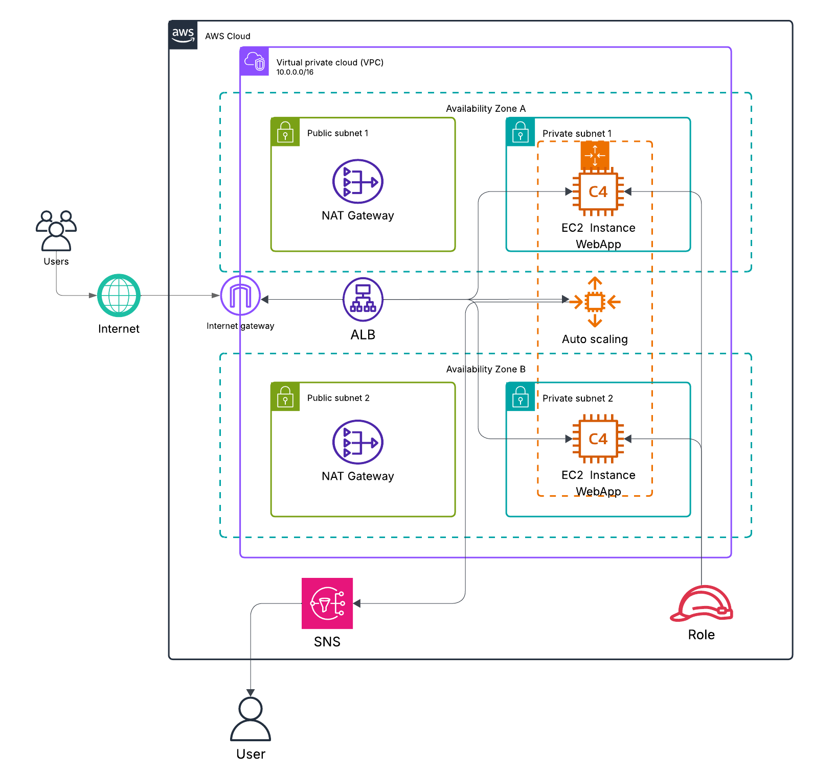
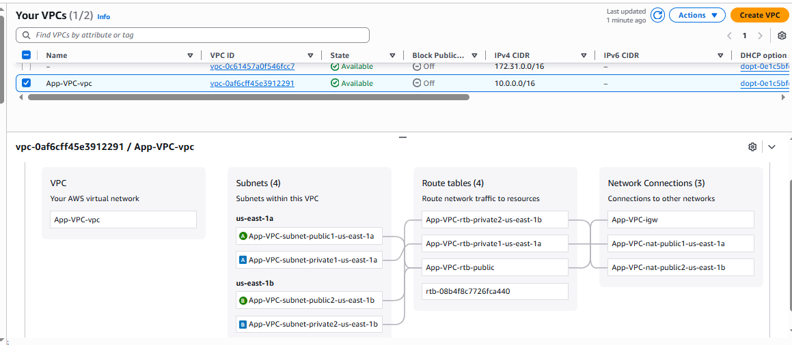
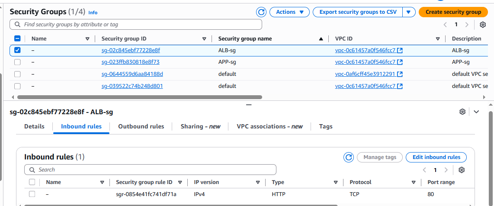
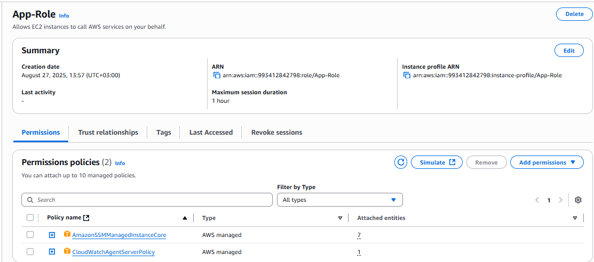
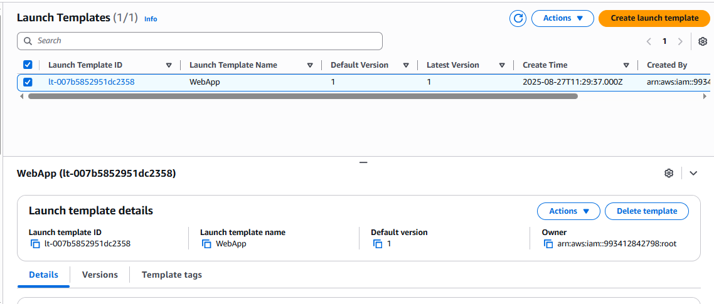
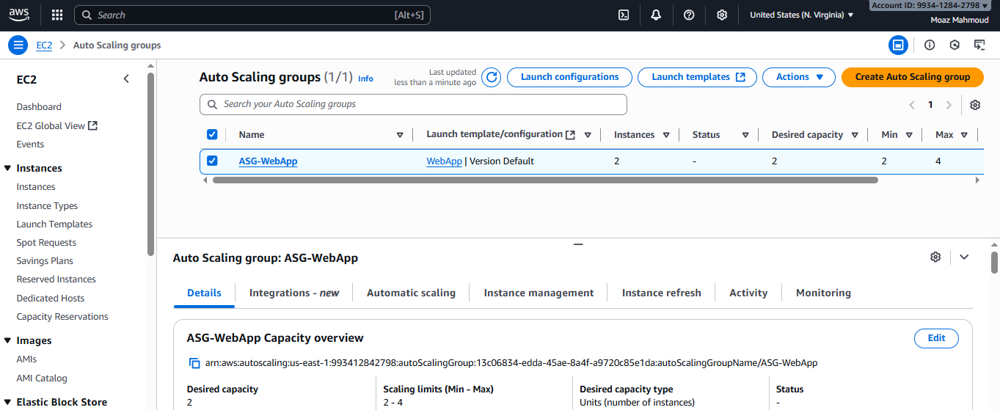
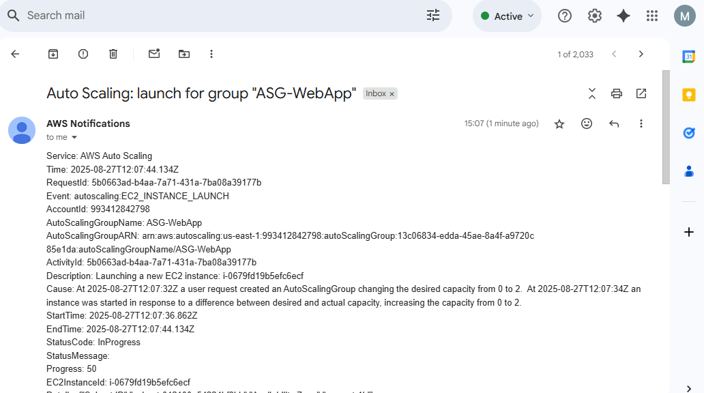
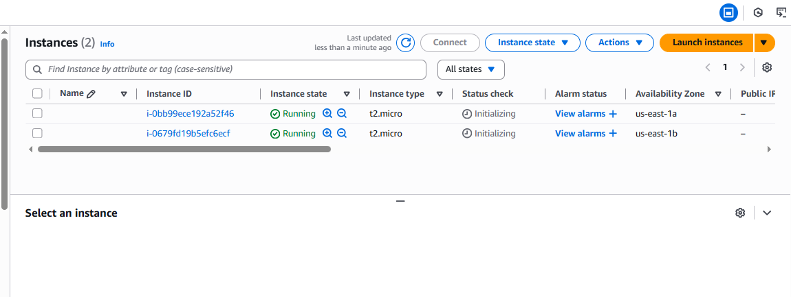

# Scalable Web Application on AWS

## Table of Contents
- [Overview](#overview)
- [Architecture Diagram](#architecture-diagram)
- [Steps](#steps)

## Overview
This project demonstrates the deployment of a **highly available and scalable web application** on AWS using **EC2 instances**, **Application Load Balancer (ALB)**, and **Auto Scaling Groups (ASG)**.  
The infrastructure is designed following AWS best practices for security, availability, and cost optimization.  

The setup ensures:
- **High availability** across multiple Availability Zones.  
- **Automatic scaling** of EC2 instances based on demand.  
- **Network isolation** using public and private subnets.  
- **Monitoring and alerts** via SNS.  

---

## Architecture Diagram
The architecture is designed for resilience and scalability:  

1. **Application Load Balancer (ALB)** in public subnets distributes traffic to backend EC2 instances.  
2. **EC2 instances** are launched in private subnets across two AZs, managed by an **Auto Scaling Group**.  
3. **NAT Gateways** in public subnets allow private instances to access the internet for updates.  
4. **Security Groups** enforce least-privilege rules:
   - ALB-SG allows inbound HTTP/HTTPS traffic from the internet.  
   - App-SG allows inbound traffic only from ALB-SG.  
5. **SNS** sends email notifications when thresholds are breached.  

---

## Steps

### 1. Networking
- Created a **VPC** with 2 public subnets and 2 private subnets across different AZs.  
- Attached an **Internet Gateway** to enable external connectivity.  
- Configured **NAT Gateways** in each public subnet for outbound access from private subnets.  
- Defined route tables:
  - Public route table routes `0.0.0.0/0` to the IGW.  
  - Private route tables route `0.0.0.0/0` to the NAT in the same AZ.
    

### 2. Security
- **ALB-SG**: Allows inbound HTTP/HTTPS from the internet.  
- **App-SG**: Allows inbound HTTP only from ALB-SG.  
- Outbound rules kept open to allow updates.
  
- IAM Role created for EC2 with minimal required permissions (e.g., SSM, CloudWatch).  
  
### 3. Launch Template
- Created an **EC2 Launch Template** with:  
  - Amazon Linux AMI.  
  - Instance type: `t2.micro`.  
  - Attached IAM Role.  
  - Assigned App-SG.  
  - User Data script to install Apache and deploy a sample app + `/health` endpoint.  

### 4. Target Group
- Configured an **Instance Target Group** with health checks on `/health`.  
- Linked to the VPC.  

### 5. Application Load Balancer
- Deployed an **Internet-facing ALB** in the two private subnets.  
- Assigned ALB-SG.  
- Listener :80 → Forward traffic to the Target Group.  

### 6. Auto Scaling Group
- Created an **ASG** using the launch template.  
- Selected the two private subnets.  
- Attached to the Target Group.  
- Set desired capacity = 2, min = 2, max = 4.  
- Configured scaling policy with CPU target tracking at 50%.  

### 7. Monitoring & Alerts 
- Configured an **SNS topic** to send notifications by email when alarms are triggered.  

---

## Outcome
- The application is accessible via the ALB DNS name.  
- EC2 instances are distributed across AZs for high availability.  
- The ASG automatically increases or decreases capacity based on load.  
- Monitoring and alerts provide operational visibility.  
